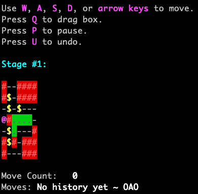
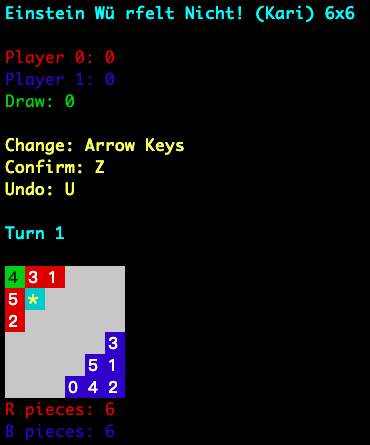

# Theory of Computer Game 2019 Fall

These are homework releases prepared by me. They are illustrated with good API and GUI for playing and solving the problem. (Written in C++11 style)

## Hw1: Pukoban

This is a variation of Sokoban, a single-agent search game. Pulling a box is allowed. This would eliminate a lot of "deadlock" situations, which stands a crucial pruning property in standard Sokoban. 

- Checkout homework spec: `hw1/release.pdf`
- Bit-state representation can be added for 10x speed-up. 
- Searches you can do: iterative-deepening, bi-directional BFS. Multithreading can be used in bi-BFS, which I tried using the [`CPTL`](https://github.com/vit-vit/CTPL).
- Results and brief explanation of submissions also included.

## Hw2: 6x6 Einstein Würfelt Nicht

This is variation of Einstein Würfelt Nicht. Rules are modified for bigger branching factor and longer game length. This challenges the agent to do decent pruning and also good evaluation of current board.

- Checkout homework spec: `hw2/release.pdf`
- Bit-state representation is always a good speed-up
- This homework is meant for students to get familiar with Monte-Carlo
- However you can try to write a good Alpha-Beta agent (why is it good in this game?)
- Baseline agent: `random`, `greedy` and `conservative` included
- The gaming program also supports AI vs. AI interface (makes grading much easier)
- Results and brief explanation of submissions also included.

